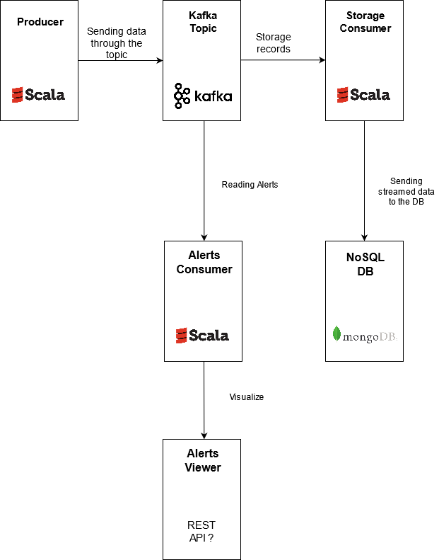

# Data Stream Architecture

## Technologies used : 
* Spark (Scala SBT)
* Kafka & Zookeeper
* MongoDB
* Flask REST Api
* Discord bot (python)
* Apache Zeppelin for charts

# Preliminary questions:
1. ### __What technical/business constraints apply to the data storage component so that statistical analysis can be easily achieved on the database with a daily data rate of 200GB ?__

        As we consider a daily data rate of 200GB, the first constraint that we must take in account is that the criteria of Availability of our database is respected. Indeed, the content of the data will not be modified all along the process as it is Drones reports. 
        
        Moreover, as long as the records from Peace Watchers can be split and partitioned across some documents, a document-database is a suitable one for us

        This way, data is grouped into sets of collections. Each collection has a unique name in the database, and can contain an unlimited number of documents. They don’t have any defined schema.
        
        Plus, NoSQL document DB offers an API or query language that allows the user to retrieve documents based on content (meta-data)
        
        Finally, of course, we never know when we will add more Drones to the nature, and the daily data rate could increase so it is important that the storage system is easy scalable and flexible. 

1. ### __What business constraint should the architecture meet to be able to quickly alert human personnel in case of emergency ?__

        Thanks to Scala, we can easily define a Kafka Producer that will send the data records through a Pipeline. Remember that the data should be easily queryable and available. So, by defining a checking function as a Kafka stream consumer, the consumer would be able to check if the data retreived from the stream is an alert once the data is produced by the Producer and we will treat it differently, by sending it to a different topic. 
        So there will be different topic treated by different Kafka Consumers through the Pipeline. Finally, such an architecture allows to be able to quickly alert human personnel in case of emergency. 

1. ### __What mistake(s) from the previous team can explain their failed attempt?__

        The previous team was composed of Data Scientists. Even though Data Scientists excel when it comes to identify patterns through datas or generally speaking "make the data talk", this problem is not a Data Scientist's problem. 
        Indeed, they probably used Python as programming language which is not adapted to this specific use. It is not specificly optimized and it is not adapted to functional programming. That's why Data Engineers use Scala, it is more scalable than Python and the Functionnal Programming shows better performance in terms of ressources. 
        More than that, they problably failed their attempt because, simply, they are not awared of the technical and business constraint we mentionned above.

1. ### __Some technical information is likely missing in the report sent by the drones. This information might make the personnel much more efficient. What is it?__

        - A timestamp of the record. It is import to know when the report was produced, is it during the evening ? the morning ? These informations could help the personnel to be much more efficient in their quest of Peace.
        - Some drone information like battery level. When the battery level is critical, it can gives its position or we can give the instruction to reach the closest station to charge. 

    
# __Our temporary architecture__

